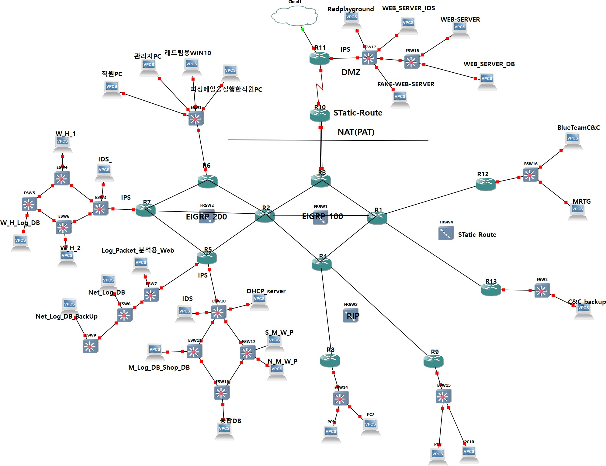
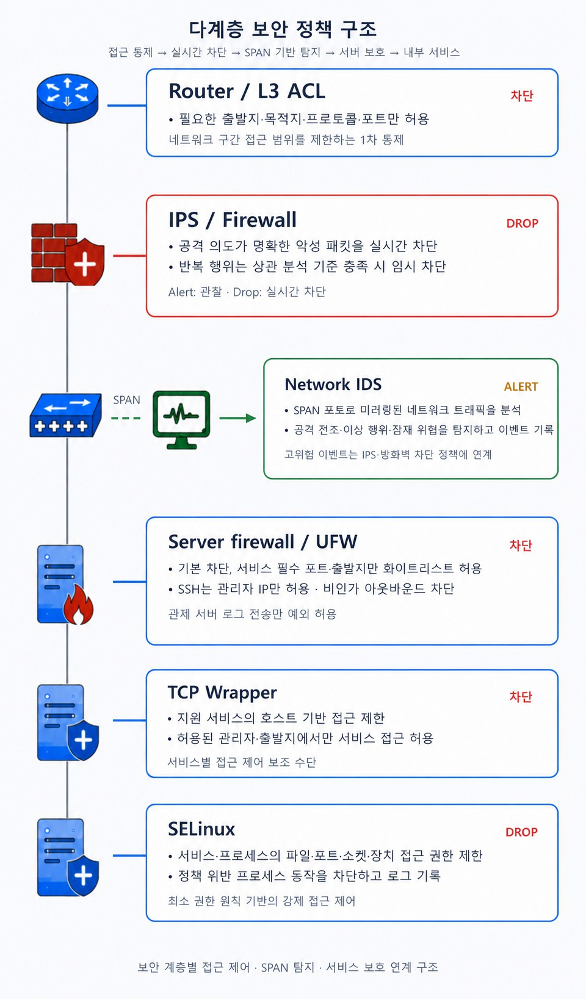

# 01. 아키텍처 — 구간 분리와 IDS/IPS 배치

## 왜 이렇게 설계했나 (설계 원칙)

쇼핑몰 인프라는 **성격이 다른 트래픽이 한 네트워크에 섞이면 사고 시 피해가 전파**된다. 그래서 세 가지 원칙을 세웠다.

1. **구간을 성격별로 분리한다** — 대외 웹서비스 / 내부 웹하드 / 모니터링·로그 / 관리(C&C)를 나누고, 구간 사이 통신은 필요한 경로만 남긴다.
2. **탐지와 차단을 계층으로 나눈다** — 하나의 장비가 모든 걸 막게 하지 않는다. 경계에서 걸러도 통과한 것은 다음 계층이 잡도록 **defense-in-depth**로 겹친다.
3. **탐지 지점을 트래픽이 반드시 지나는 곳에 둔다** — IDS는 SPAN(미러링), IPS는 인라인(브리지)으로 배치해 우회 경로를 없앤다.

---

## 네트워크 구간

라우팅은 코어망(EIGRP AS 100)과 서비스망(EIGRP AS 200)을 분리하고 하위 RIP·Static/NAT를 Redistribution으로 연동했다. 보안관제 관점에서 중요한 것은 **각 구간에 어떤 자산이 있고, 그 앞에 어떤 탐지/차단 장비가 서는가**이다.



| 구간 | 주요 자산 | 대역(예) | 앞단 보안장비 |
|---|---|---|---|
| 대외 웹서비스 (RedZone/DMZ) | 취약 쇼핑몰 WS01, 보안 쇼핑몰 WS02, DB06 | 10.60.0.0/20 | **IDS03 + IPS03** |
| 내부 웹하드 | HD01(Pydio), HD02(ownCloud), DB01 | 10.30.192.0/20 | **IDS01 + IPS01** |
| 모니터링·로그 | MR01(MRTG), MR02(Cacti), DB02~05 | 10.30.96.0/20 | **IDS02 + IPS02** |
| 관리 (C&C) | MS01(DNS/DHCP), MS02(분석), MS03/04 | 10.40.0.0/19 · 10.30.112.0 | 서버 방화벽 + 관리망 ACL |

> 전 구간은 NTP로 시각을 동기화한다. **타임스탬프가 어긋나면 여러 로그를 시간순으로 엮는 상관분석이 불가능**하기 때문이다.

---

## IDS / IPS 배치 전략

### IDS는 SPAN, IPS는 인라인(브리지)

| 구분 | 배치 방식 | 이유 |
|---|---|---|
| **IDS (Snort3)** | 스위치 SPAN 포트로 트래픽 **복제** 수신 | 트래픽 경로에 끼어들지 않아 **장애·지연을 유발하지 않고** 전 구간을 관찰. 대신 직접 차단은 불가 → Alert 전용 |
| **IPS (pfSense+Suricata)** | 세그먼트 앞단에 **브리지(투명) 모드**로 삽입 | L3 라우팅·IP 체계를 바꾸지 않고 인라인 배치 → **실시간 DROP 가능**, 이미 구축된 인프라에 재설계 없이 삽입 |

브리지 모드가 핵심이었다. 구성이 끝난 인프라 중간에 IPS를 넣어야 하는 상황에서, **IP 체계나 라우팅을 건드리지 않고** 배치 지점만 고르면 되므로 IPS를 3개 구간에 다중 배치할 수 있었다.

### 장비별 역할 분담

| 장비 | 구간 | 플랫폼 | 운용 중점 |
|---|---|---|---|
| IDS01 / IPS01 | 웹하드 | Snort3 / pfSense+Suricata | 악성 파일 반입 차단, 역접속(C2) 아웃바운드 차단 |
| IDS02 / IPS02 | 모니터링 | Snort3 / pfSense+Suricata | 관제 체계 보호, 데이터 유출·로그 위조 차단 |
| IDS03 / IPS03 | 대외 웹서비스 | Snort3 / pfSense+Suricata | 외부 유입 웹 공격 1차 차단, 정찰·스캐닝 탐지 |

---

## 다계층 방어 (Defense-in-Depth)

한 계층이 뚫려도 다음 계층이 잡도록 조치 권한을 나눴다.



| 계층 | 핵심 관점 | 주요 역할 | 조치 권한 |
|---|---|---|---|
| Router / L3 ACL | 통신 경로 | 접근 가능한 네트워크 대역 제한 | 차단 |
| IPS / Firewall | 공격 트래픽 | 패킷으로 탐지된 명확한 악성 트래픽 차단 | **DROP** |
| Network IDS | 행위 탐지·분석 | 공격/비정상 서비스 행위 탐지 | **Alert** |
| firewalld / UFW | 호스트 서비스 | 서비스 필수 포트·출발지만 허용 | 차단 |
| TCP Wrapper | 서비스 접근 보조 | 호스트 기반 접근 제한 | 차단 |
| SELinux | 프로세스 제어 | 파일·포트·소켓 접근 권한 제한 | DROP |
| 분석·관제 (C&C) | 상관분석 | 로그·패킷 상관분석, 공격 의도 판정 | Alert / DROP 후보 |

**계층별로 "잡는 것"이 다르다는 게 핵심이다.**
- ACL은 *경로*를 막고 (누가 어디에 접근 가능한가)
- IPS는 *패킷*을 막고 (이 트래픽이 악성인가)
- IDS는 *행위*를 관찰하고 (이 흐름이 공격 전조인가)
- 서버 방화벽은 *서비스*를 지킨다 (이 포트로 이 출발지가 와도 되는가)

---

## 관제 데이터 파이프라인

IDS 센서가 수집한 패킷·Alert와 각 서버 로그는 중앙 관제 서버(C&C, MS02)로 모여 상관분석된다. **센서는 수집·전송만, 부하가 큰 분석은 중앙에서** 처리하도록 역할을 분리했다.


```
IDS 센서(libpcap + Snort3 alert)
   │  BPF 1차 필터 → 자체 바이너리 프로토콜 → TCP 소켓(:19000)
   ▼
C&C Receiver ── dpkt 파싱(L2~L7) → IP/TCP 재조립 → Anomaly/Detector 판정
   │
   ▼
Log DB ◀── rsyslog(514/tcp) ── 서버 로그(access/modsec/mariadb/auditd/ftp/dns/snmp)
   │    ◀── syslog-ng ── 보안장비 로그(pfSense firewall, Suricata eve.json)
   ▼
ALPACA SIEM (통합 조회·상관분석·정오탐 판정)   ← 퍼플-관제팀 협업 산출물
```

- **로그 수집**: 리눅스 서버는 `rsyslog imfile`로 원본 로그를 읽어 C&C의 `514/TCP`로 전송, 송신 IP별 디렉터리(`/var/log/remote/<ip>/<program>.log`)에 저장. 보안장비(pfSense/Suricata)는 `syslog-ng`로 전송.
- **보관 정책**: `logrotate`로 파일당 100MB·90일 보관(초과분 gzip 압축·자동 삭제), DB는 매일 03:00 배치로 90일 초과분 Purge → 디스크 고갈로 인한 관제 마비 예방.

> **내 담당 범위 표시**: 이 파이프라인에서 **IDS 센서의 Snort3 탐지 룰**과 **IPS/서버 방화벽 차단 정책**이 내 담당이다. 중앙 파싱 엔진과 ALPACA SIEM, KISA 주정통 점검 자동화는 퍼플팀 협업 산출물이며, 본 포트폴리오는 탐지·차단 계층에 초점을 둔다.

---

### 다음 문서
→ [02. Snort3 IDS 탐지 설계](02-ids-snort3.md)
