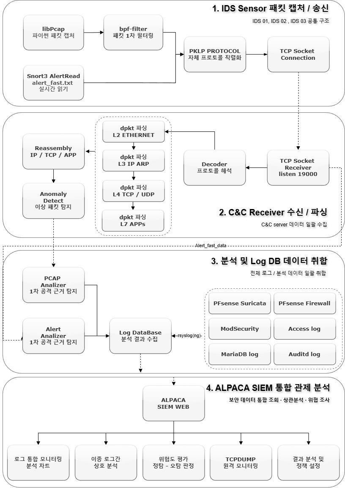
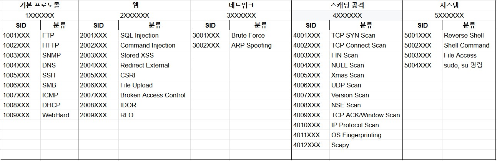
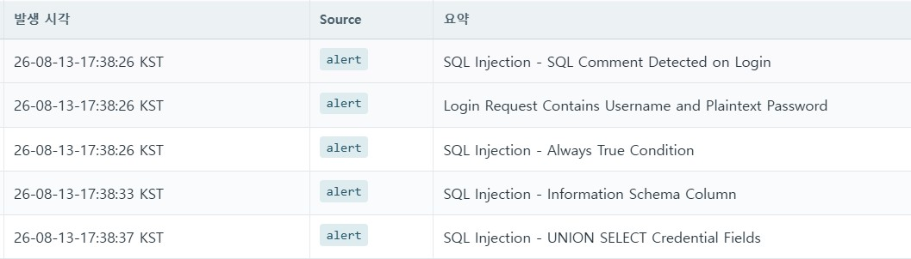

# 02. Snort3 IDS 탐지 설계

## 목차
- [왜 Snort3인가 (도구 선택)](#왜-snort3인가-도구-선택)
- [탐지 구조](#탐지-구조)
- [SID 룰셋 분류 체계](#sid-룰셋-분류-체계)
- [룰셋 분배 정책 — Alert냐 Drop이냐](#룰셋-분배-정책--alert냐-drop이냐)
- [IDS별 역할 분담](#ids별-역할-분담)
- [기본 프로토콜 탐지 (IDS01/02)](#기본-프로토콜-탐지-ids0102)
- [시나리오별 웹 공격 탐지 (IDS03)](#시나리오별-웹-공격-탐지-ids03)
- [단발 매칭을 넘어 — 임계·행위 기반 탐지](#단발-매칭을-넘어--임계행위-기반-탐지)

---

## 왜 Snort3인가 (도구 선택)

처음에는 패킷 수집·침입 탐지·이벤트 저장·모니터링이 통합된 **Security Onion**으로 관제 환경을 구축하려 했다. 그러나 실제 적용 과정에서 **패킷 누락과 이벤트 처리 지연**이 반복됐다.

- **패킷 누락**: DAQ로 쓰인 **PF_RING의 수신 불량**. `tcpdump`로는 패킷이 정상 수신되는데 PF_RING 통계는 간헐적으로 `Received: 0, Analyzed: 0` → 패킷이 유실되고 있었다.
- **처리 지연**: Snort2가 쌓는 `snort.unified2.*`는 실시간으로 커지는데 이를 넘겨받을 **Barnyard2가 멈추는** 현상. 재기동하면 누적 스풀을 일괄 처리하며 **CPU 90%** 까지 치솟아 구조적으로 불안정했다.

> **판단**: 통합 솔루션을 그대로 신뢰하지 않고 병목을 실측했다. 원인이 수집 계층(PF_RING)과 후처리 계층(Barnyard2) 양쪽에 있어, **Security Onion 의존을 걷어내고 Snort3 + Python으로 수집·분석 파이프라인을 직접 구성**하기로 결정했다.
>
> 진단 과정 상세 → [04. 트러블슈팅](04-troubleshooting.md)

---

## 탐지 구조

센서는 **수집·전송만**, 부하가 큰 파싱·재조립·판정은 **중앙 서버**가 담당하도록 역할을 분리했다. 센서가 무거워지면 그 자체가 패킷을 흘리기 때문이다.



| 단계 | 구현 | 효과 |
|---|---|---|
| 수집 | libpcap 실시간 캡처 + Snort3 `alert_fast.txt` 수집 | 원본 패킷·Alert와 수집 시각 유지 |
| 수집 범위 제한 | **BPF 필터**로 IP·ARP만 사전 선별 | 불필요한 패킷 처리 제거 |
| 전송 | 자체 바이너리 프로토콜 + Batch 전송, 단절 시 재연결·재전송 | 다중 IDS를 단일 서버에서 구분 수신, 유실 최소화 |
| 파싱 | Ethernet·IP·TCP·UDP·L7 직접 파싱 | 필요한 필드만 선별 추출 |
| 흐름 분석 | IP/TCP 재조립 + 양방향 Flow 추적 | 분할 패킷·요청/응답 관계 복원 |
| 판정 | Packet·Flow·시간을 결합한 **상태형 탐지** | 스캔·세션 탈취·업로드 등 복합 행위 판정 |

**설계 포인트 — Anomaly와 Detection의 분리**: 단일 패킷에서 본 이상은 `Anomaly`로만 기록하고, Packet·Flow·시간·응답을 종합한 결과만 `Detector`가 "공격"으로 판정한다. 이렇게 나누면 **의심(관찰) 과 확정(공격) 의 경계가 명확**해져 오탐이 줄어든다.

---

## SID 룰셋 분류 체계

룰이 수백 개로 늘면 관리가 안 된다. 그래서 **SID 앞자리로 공격 성격을 구분**하는 체계를 먼저 세우고 룰을 채워 넣었다.



| SID 범위 | 대분류 | 중분류 예시 |
|---|---|---|
| `1XXXXXX` | 기본 프로토콜 | 1001 FTP · 1002 HTTP · 1003 SNMP · 1004 DNS · 1005 SSH · 1006 SMB · 1007 ICMP · 1008 DHCP · 1009 WebHard |
| `2XXXXXX` | 웹 공격 | 2001 SQLi · 2002 Command Injection · 2003 Stored XSS · 2004 Redirect · 2005 CSRF · 2006 File Upload · 2007 Broken Access Control · 2008 IDOR · 2009 RLO |
| `3XXXXXX` | 네트워크 공격 | 3001 Brute Force · 3002 ARP Spoofing |
| `4XXXXXX` | 스캐닝·정찰 | 4001 SYN · 4002 Connect · 4003 FIN · 4004 NULL · 4005 Xmas · 4006 UDP · 4007 Version · 4008 NSE · 4009 ACK/Window · 4010 IP Protocol · 4011 OS Fingerprint · 4012 Scapy |
| `5XXXXXX` | 시스템 공격 | 5001 Reverse Shell · 5002 Shell Command · 5003 File Access · 5004 sudo/su |
| `6XXXXXX` | 테스트 | 룰 테스트·실험용 |

**왜 이렇게 나눴나**: SID 앞자리만 봐도 (1) 어떤 성격의 공격인지, (2) 어느 IDS/IPS 구간이 담당하는지, (3) Alert로 볼지 Drop으로 막을지가 바로 판단된다. 분류 체계 자체가 **룰 분배와 운영 정책의 기준**이 된다.

---

## 룰셋 분배 정책 — Alert냐 Drop이냐

**같은 룰이라도 위치에 따라 운용이 다르다.** 오탐 가능성과 서비스 영향으로 갈랐다.

| 배치 | 대상 | 예시 |
|---|---|---|
| **IPS Drop** | 공격 의도가 명확하고 오탐 가능성이 낮음 | RLO 문자열 탐지, `UNION SELECT` + password 컬럼 조회 |
| **IPS Alert** | 차단 후보지만 관찰이 필요 | 파일 위험 확장자 탐지 |
| **IDS Alert** | 공격 판단에 추가 분석이 필요한 행위 | Nmap scan, Login Fail |

> **원리**: IDS는 트래픽을 직접 끊지 못하므로 **넓게 Alert**로 깔아 분석 이벤트를 확보한다(공격 전조·정찰 단계까지). IPS는 오탐이 곧 서비스 장애이므로 **확정 시그니처만 Drop**한다. 이 분배가 뒤 문서의 IPS 차등 정책으로 이어진다. → [03. IPS·방화벽](03-ips-firewall.md)

---

## IDS별 역할 분담

| IDS | 위치 | 목적 | 주요 룰셋 |
|---|---|---|---|
| **IDS01** | 내부 웹하드 | FTP/SMB·웹하드 패킷 탐지 | `1XXXXXX` |
| **IDS02** | 내부 모니터링 | SNMP/DNS/SSH/DHCP 패킷 탐지 | `1XXXXXX` |
| **IDS03** | 취약 쇼핑몰 / RedZone | 웹 공격·정찰 시나리오 | `2·3·4·5XXXXXX` |

내부망(IDS01/02)은 **정상 프로토콜의 오남용**을, 대외망(IDS03)은 **외부 웹 공격·스캔**을 본다. 같은 Snort3라도 보는 트래픽 성격이 달라 룰셋을 완전히 분리했다.

---

## 기본 프로토콜 탐지 (IDS01/02)

내부망은 "허용된 프로토콜이 비정상적으로 쓰이는가"를 본다. 대표 시그니처:

### FTP (SID 1001XXX)
| SID | 탐지 | 의미 |
|---|---|---|
| 1001005 | 제어 채널 `USER` 명령 | 인증 시도 관찰 |
| 1001007 | 제어 채널 `PASS` 명령 | 자격증명 전송 관찰 |
| 1001113 | `SIZE` 명령 | 원격 파일 크기 탐색 |
| 1001203 | `CWD /` | 절대경로 이동(디렉터리 이탈) 시도 |

### SMB (SID 1006XXX)
| SID | 탐지 | 바이트 패턴 |
|---|---|---|
| 1006001 | `TREE_CONNECT` + `C$` 관리자 공유 접근 | `FE 53 4D 42` + `03 00` + `C 00 $ 00` |
| 1006003 | `STATUS_LOGON_FAILURE` 반복(로그인 실패) | `FE 53 4D 42` + `6D 00 00 C0` |

> SMB는 텍스트가 아니라 **바이트 시그니처**로 매칭한다. `FE 53 4D 42`는 SMB2 프로토콜 ID(`\xFESMB`)이고, 뒤의 명령 코드·상태 코드로 관리자 공유 접근이나 로그인 실패를 구분한다.

### SSH (1005XXX) / DHCP (1008XXX)
| SID | 탐지 |
|---|---|
| 1005003 | 동일 IP에서 `SSH-2.0-` 배너로 세션 반복 생성 |
| 1008001 / 1008002 | 승인된 `$DHCP_SERVER`가 아닌 서버의 DHCP OFFER(Type 2) / ACK(Type 5) → **Rogue DHCP** |
| 1008004 | 5초 동안 브로드캐스트 DHCP DISCOVER(Type 1) **29회 초과** → 고갈 공격 의심 |

```snort
# Rogue DHCP 서버 탐지 — 승인 서버가 아닌 곳에서 OFFER가 나가면 Alert
alert udp !$DHCP_SERVER 67 -> $HOME_NET 68 (
    msg:"PROTOCOL-DHCP Rogue Server OFFER";
    content:"|02|", offset 0, depth 1;      # BOOTP op=2 (reply)
    content:"|35 01 02|";                    # DHCP Message Type = OFFER
    sid:1008001; rev:1;
)
```

---

## 시나리오별 웹 공격 탐지 (IDS03)

IDS03는 레드팀 4개 시나리오의 **전 단계**를 탐지하도록 설계했다. 아래는 각 시나리오에 실제로 매핑한 SID·시그니처다.

### SCN-01 · SQL Injection (인증 우회 → 스키마 열거 → 개인정보 탈취)

| 공격 단계 | SID | 메시지 | 탐지 로직 |
|---|---|---|---|
| 인증 우회(주석) | 2001006 | SQL Injection - SQL Comment Detected on Login | `pcre:"/(?:--|#|\/\*)/"` |
| 인증 우회(항진식) | 2001010 | SQL Injection - Always True Condition | `' OR '1'='1' -- -` |
| 평문 자격증명 | 2000001 | Login Request Contains Username and Plaintext Password | 로그인 평문 전송 |
| 스키마 열거 | 2001009 | SQL Injection - Information Schema Column | `information_schema` 조회 |
| 자격증명 덤프 | 2001008 | SQL Injection - UNION SELECT Credential Fields | password 관련 컬럼 조회 |

```snort
# 로그인 SQLi — 주석 문자로 뒤 조건을 무력화하는 인증 우회
alert tcp $EXTERNAL_NET any -> $HTTP_SERVERS 80 (
    msg:"SQL Injection - SQL Comment Detected on Login";
    flow:to_server,established;
    http_uri;         content:"/login.php";
    http_client_body; content:"username";
    pcre:"/(?:--|#|\/\*)/";
    sid:2001006; rev:1;
)
```



*로그인 SQLi(주석·항진식·평문 자격증명) → 스키마 열거 → UNION 자격증명 덤프가 시간순으로 탐지된 실제 Alert 목록.*

> **탐지 근거의 확정**: IDS Alert만으로는 "시도"인지 "성립"인지 알 수 없다. 그래서 관제에서 **nginx access의 로그인 성공(302)** 과 **MariaDB audit의 `' OR '1'='1' -- -` 쿼리**를 같은 시각으로 엮어 *인증 우회가 실제로 성립했음*과 *가해 IP*를 확정한다. (상관분석은 ALPACA에서 수행 — 팀 협업)

### SCN-02 · 정찰(Zenmap) + 저장형 XSS

| 공격 | SID | 탐지 로직 |
|---|---|---|
| TCP SYN Scan | 4001001 | 동일 IP가 **5초 내 SYN 30개 이상** |
| SYN Scan RST/ACK | 4001002 | 5초 내 RST/ACK 30개 이상 (방화벽 미적용 시에만 관측) |
| Nmap SSH Hostkey 열거 | 4008002 | 내부 SSH(22) 접속 후 Nmap 열거용 배너 전송 |
| OpenSSH 배너 노출 | 4007003 | 서버가 `SSH-2.0-OpenSSH_` 버전 배너 응답 |
| MariaDB 스캔 | 4007006 | 동일 IP가 **10초 내 3306 연결 5회 이상** |
| IP Protocol Scan(-sO) | 4010001 | **30초 내 payload 0바이트 IP 패킷 90개 이상** |
| 저장형 XSS(쿠키) | 2003005 | `document.cookie` 포함 |
| XSS Script Tag | 2003001 | `<script>` 태그 삽입 |

### SCN-03 · 파일 업로드 리버스 셸 (RCE)

| 공격 단계 | SID | 메시지 |
|---|---|---|
| 위험 확장자 업로드 | 2006002 | FILE UPLOAD - Filename Extension and Content-Type Mismatch (`.php/.js/.exe/.sh/.py/.reg`) |
| 웹셸 실행(명령) | 5002001 | WEB SHELL - Interactive Shell Command Detected in Raw TCP Data (`pwd,id,whoami,uname -a,ls,cat,cd,chmod`) |
| 리버스 셸(아웃바운드) | 5001001 | WEB SHELL - Outbound TCP Connection (서버→외부 SYN) |
| 외부 연결 명령 | 5001003 | Bash Shell - External Connection (`nc`, `/dev/tcp`) |
| 셸 실행 | 5001002 | Bash Shell - Command Attempt (`/bin/bash`, `bash -i`) |

```snort
# 리버스 셸 — 서버가 외부로 능동 SYN을 내보내는 이상 아웃바운드
alert tcp $HTTP_SERVERS any -> $EXTERNAL_NET any (
    msg:"WEB SHELL - Outbound TCP Connection";
    flow:to_server;            # 서버가 스스로 커넥션을 여는 방향
    flags:S;
    sid:5001001; rev:1;
)
# 업로드 파일 내부의 bash 리버스 셸 페이로드
alert tcp any any -> any any (
    msg:"Bash Shell - Command Attempt";
    content:"bash -i"; nocase;
    pcre:"/\/dev\/tcp\/\d{1,3}(?:\.\d{1,3}){3}\/\d+/";
    sid:5001002; rev:1;
)
```

> **핵심 관점**: 웹 계층(업로드 탐지)에서 놓쳐도 **시스템 계층의 이상 아웃바운드(서버→공격자 4444/tcp)** 에서 다시 잡힌다. 하나의 공격을 서로 다른 계층에서 겹쳐 탐지하도록 SID를 배치했다.

### SCN-04 · 로그인 브루트포스

| 공격 | SID | 탐지 로직 |
|---|---|---|
| 무차별 대입 | 3001001 | 로그인 요청이 **60초 내 10회 이상** |
| 평문 자격증명 노출 | 2000001 | 로그인 요청에 username+평문 password 포함 |

---

## 단발 매칭을 넘어 — 임계·행위 기반 탐지

SQLi 문자열 같은 건 **한 패킷**만 봐도 되지만, **스캔·브루트포스·플러딩**은 한 패킷으로 판단할 수 없다. 이런 공격은 "짧은 시간에 같은 행위가 몇 번 반복되는가"로 정의되며, Snort3의 `detection_filter`로 **출발지별 임계값**을 건다.

| 공격 | 판정 기준 | 관련 SID |
|---|---|---|
| TCP SYN Scan | 동일 IP, 5초 / SYN 30개↑ | 4001001 |
| MariaDB 스캔 | 동일 IP, 10초 / 3306 연결 5회↑ | 4007006 |
| IP Protocol Scan | 동일 IP, 30초 / 0바이트 IP 90개↑ | 4010001 |
| DHCP DISCOVER 플러딩 | 5초 / 29회 초과 | 1008004 |
| 로그인 브루트포스 | 동일 IP, 60초 / 10회↑ | 3001001 |

```snort
# 포트스캔 — 한 출발지에서 짧은 시간에 SYN이 몰리면 스캔으로 판정
alert tcp $EXTERNAL_NET any -> $HOME_NET any (
    msg:"SCAN - TCP SYN Scan";
    flags:S;
    detection_filter:track by_src, count 30, seconds 5;
    sid:4001001; rev:1;
)
# 로그인 브루트포스 — 60초 내 /login.php 요청 10회 초과
alert tcp $EXTERNAL_NET any -> $HTTP_SERVERS 80 (
    msg:"BF - Login Attempt";
    flow:to_server,established;
    http_uri; content:"/login.php";
    detection_filter:track by_src, count 10, seconds 60;
    sid:3001001; rev:1;
)
```

> **`detection_filter` vs `threshold`**: `detection_filter`는 임계값을 넘긴 *다음*부터 Alert를 발생시켜 "정상적인 소수 요청"의 오탐을 줄인다. 다만 임계 기반 탐지는 **정상 트래픽이 우연히 임계를 넘으면 오탐**이 된다 — 실제로 RDP 세션의 ACK 통신을 스캔으로 오탐한 사례가 있었고, 이를 상관분석으로 튜닝했다. → [04. 트러블슈팅](04-troubleshooting.md#3-오탐-튜닝-ack_scan)

---

> ⚠️ 이 문서의 룰 코드는 보고서에 기록된 **탐지 로직(메시지·시그니처·임계값)을 Snort3 문법으로 재구성한 대표 예시**입니다. 전체 룰 파일은 [`rules/`](../rules/) 참고.

### 다음 문서
→ [03. IPS·서버 방화벽](03-ips-firewall.md)
