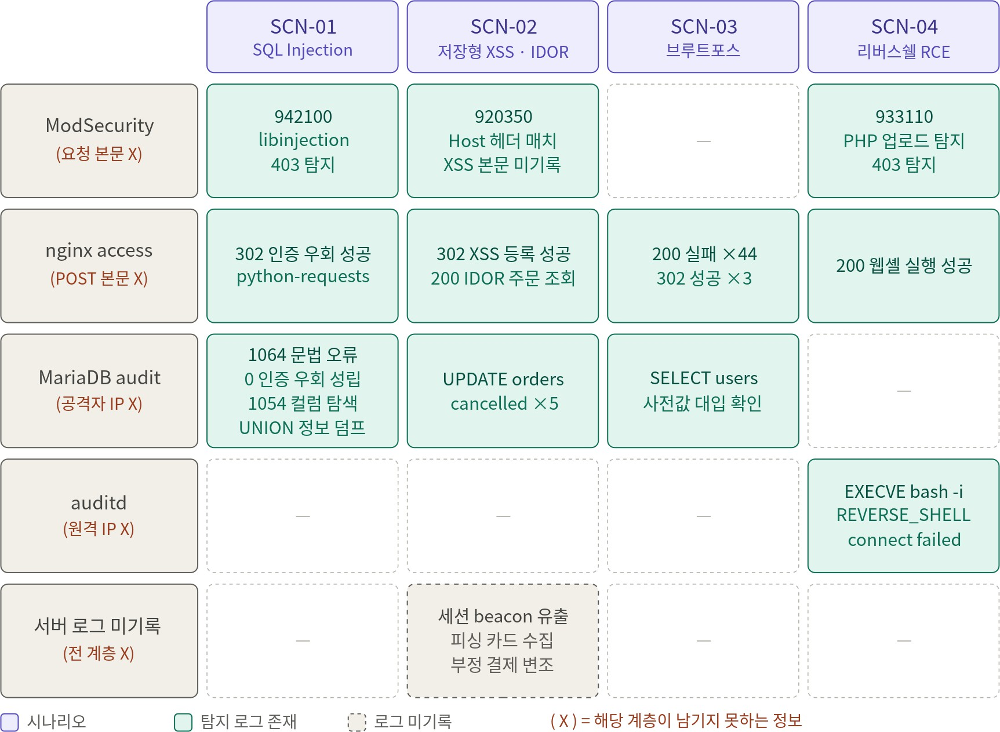
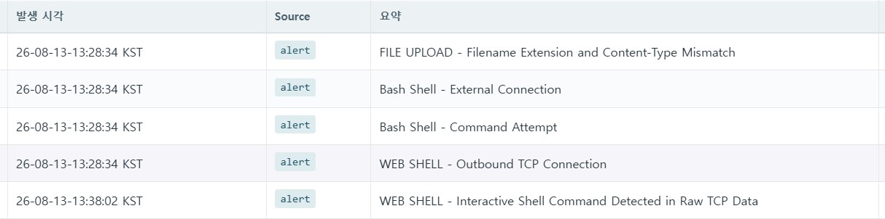
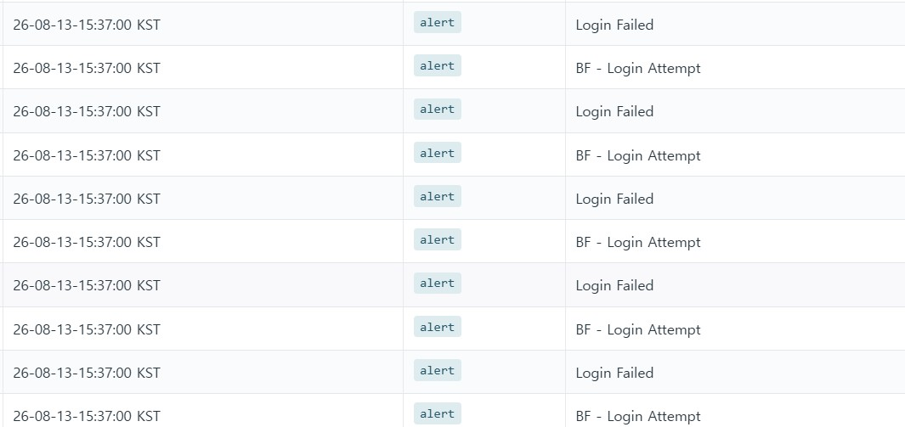

# 05. 검증 · 결과

레드팀의 실제 공격에 대해 **내가 설계한 IDS 탐지·IPS 차단이 실제로 동작했는가**를 검증한 결과다.

---

## 시나리오별 다층 탐지 매트릭스

하나의 공격을 여러 계층(pcap / IDS alert / access / WAF / DB / auditd)에서 겹쳐 탐지하도록 설계했다. **각 계층이 구조적으로 남기지 못하는 정보가 있기 때문에, 여러 로그를 엮어야 단일 로그로는 못 얻는 결론에 도달**한다.

| 시나리오 | 확정된 탐지 근거 (계층 상관) |
|---|---|
| **SCN-01** SQLi | IDS `2001006/2001010` + WAF `942100`(403) + **nginx 302 성공** + MariaDB audit `' OR '1'='1'` → *인증 우회 성립*과 가해 IP 확정 |
| **SCN-02** XSS·IDOR | WAF `920350` + nginx XSS 등록(302)/IDOR 조회(200) + MariaDB `UPDATE orders cancelled ×5` → 세션 beacon 유출은 대상 서버 미경유라 DB 흔적으로 피해 추정 |
| **SCN-03** RCE | WAF `933110`(403) + IDS `5001001` 아웃바운드 + **auditd `EXECVE bash -i` → `no route to host`** → 업로드→실행→역접속 전 과정 확정, **방화벽 egress가 C2 차단** |
| **SCN-04** 브루트포스 | IDS `3001001`(60초 임계) + nginx **실패 200 ×44 / 성공 302 ×3** + MariaDB 사전값 대입 → 302가 유효 계정의 유일한 신호 |

> **핵심 원리**: SCN-02의 카드 수집·부정 결제는 외부 피싱 서버에서 일어나 **대상 서버 로그에 남지 않는다.** 그래도 앞뒤의 XSS 등록·주문 취소 로그로 *피싱 가능성을 추정하고 피해 규모를 DB 흔적으로 산정*할 수 있다. 단일 시그니처가 아니라 **탐지 계층의 조합**으로 사건을 재구성하는 것이 이 설계의 목표였다.

---

## 실제 탐지 결과 (발췌)

### SCN-03 파일 업로드 리버스 셸 탐지

- `2006002` 확장자·Content-Type 불일치 → `5001001` 서버 아웃바운드 SYN → `5001003` `/dev/tcp` 외부 연결까지 단계별 탐지.
- 서버 방화벽 아웃바운드 차단으로 리버스 셸 연결이 `no route to host` 실패 (egress 통제 효과 실증).

### SCN-04 로그인 브루트포스 탐지

- `3001001` 60초 10회 임계 탐지 + 평문 자격증명(`2000001`) + 실패(200)/성공(302) 응답 패턴 상관.

---

## 구현도 평가 (IPS/IDS 담당 항목)

프로젝트 목표를 성공 기준·검증 방법과 함께 자체 평가했다. **미달 항목(△/X)도 사유와 함께 그대로 기록**했다.

| ID | 구현 목표 | 판정 | 비고 |
|---|---|:---:|---|
| PP-01 | pfSense 기반 IPS(방화벽+Suricata inline) 구축 | ✅ O | 브리지 구성, 룰 매칭 트래픽 DROP·정상 통과 확인 |
| PP-02 | Snort3 자체 보안관제(Security Onion 대체) | ✅ O | 공격 시나리오에서 실시간 탐지·로그 생성 확인 |
| PP-07 | 기본 프로토콜·공격별 룰셋 생성 | 🔸 △ | 핵심 룰셋 구현·검증, 일부 프로토콜 룰 미구현 |
| PP-08 | 룰셋 Alert/Drop·위치(IPS/IDS) 분배 | 🔸 △ | 분배 정책 수립·적용, pfSense IPS 룰 일부만 적용 |
| PP-11 | 보안장비 로그 C&C 전송(syslog-ng) | ✅ O | pfSense 방화벽·Suricata 로그 정상 수신 |
| PP-16 | 패킷 이벤트 유형별 분석 | ✅ O | 동일 시간대·IP 기준 이벤트 연계 확인 |
| PP-17 | 관제 페이지 이벤트 목록·상세 조회 | ✅ O | PCAP·IDS·IPS·로그 이벤트 조회 |
| PP-18 | tcpdump 원격 캡처 | ✅ O | 인터페이스·필터 조건 실행 확인 |
| PP-03~05 | H-IDS(Rocky/Ubuntu/Windows) | ⬜ X | 구현 시간 부족 (개선 대상) |

전체 20개 목표 중 다수 달성, 3개 미구현(H-IDS)·2개 부분 구현(룰셋 일부). **경계 IDS/IPS는 목표대로 동작**했고, 호스트 기반 IDS(H-IDS) 확장은 다음 과제로 남았다.

---

## 한계 및 개선 계획

솔직한 자기 평가 — 면접에서 "다음에 어떻게 개선하겠나"에 대한 답이기도 하다.

| 항목 | 현재 한계 | 개선 계획 |
|---|---|---|
| WAF 운용 모드 | DetectionOnly로 운영돼 실제 차단 효과 검증 제한 | 오탐 검증 후 `SecRuleEngine On` 전환 |
| 분석 프로토콜 | IP/TCP/ARP/HTTP/DNS/DHCP/SNMP/FTP/SSH/SMB 한정 | 분석 프로토콜 확대로 시나리오 대응 폭 확장 |
| 임계 탐지 오탐 | 단순 횟수 기반이라 정상 트래픽 오탐 여지 | 행위 특성(핸드셰이크율·포트 분산) 결합 판정 |
| H-IDS | Rocky/Ubuntu/Windows 호스트 IDS 미구현 | Suricata H-IDS 배포·검증 완성 |
| 자동 차단 연계 | 정탐 IP의 IDS 룰셋 실시간 반영 일부 미구현 | IP 통제 DB → 각 IDS/IPS 장비 자동 배포 완성 |

---

## 종합

- 레드팀 4개 공격 시나리오 **전 단계에 대한 탐지 시그니처를 설계**하고, 실제 공격 트래픽에서 다층 상관으로 탐지·확정.
- IPS 룰에 대해 공격 트래픽 **DROP 처리 확인**, 서버 egress 통제로 **리버스 셸 C2 차단 실증**.
- 근본 원인은 개별 취약점이 아니라 **웹 보안 기본 통제의 부재가 연쇄 결합**된 것이라는 결론 → WAF 시그니처 차단만으로는 한계, 애플리케이션 계층의 근본 조치가 선행되어야 함을 문서화.

---

← [README로 돌아가기](../README.md)
